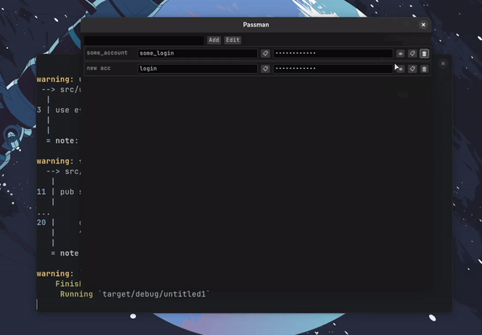

Passman - Your Secure Password Manager

Passman is a user-friendly and secure password manager designed to simplify your online life. With Passman, you can store and manage all your passwords, credit card details, and sensitive information in one secure place. Say goodbye to the hassle of remembering complex passwords and struggling to keep your digital life organized.
Features

    Password Generator: Easily create strong, unique passwords for all your accounts.

    Cross-Platform: Access your passwords from any device with Passman's web and mobile apps. 

    Password Sharing: Share passwords with trusted contacts securely.

Demo:

Passman is released under the MIT License. Feel free to use, modify, and distribute it in accordance with the license terms.

